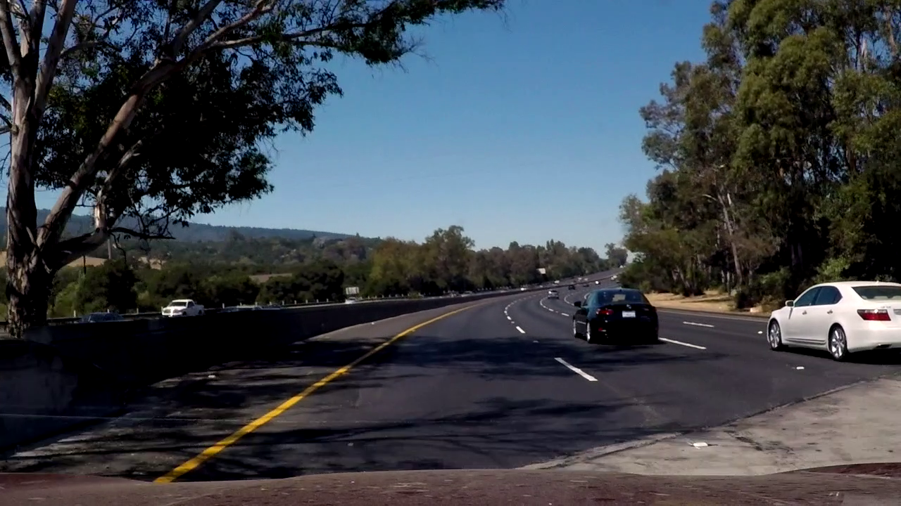
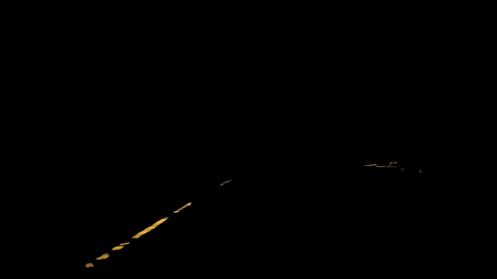
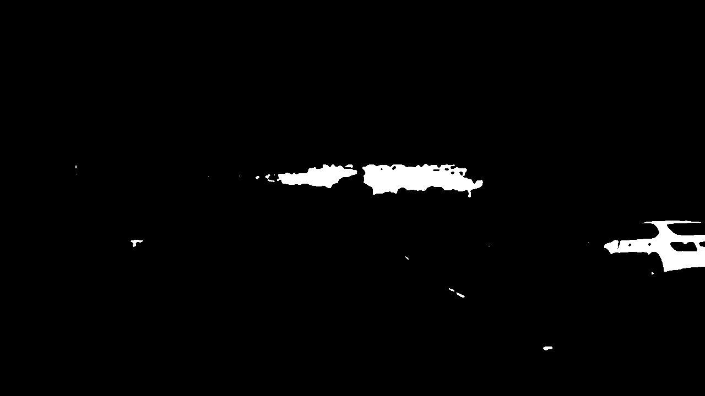
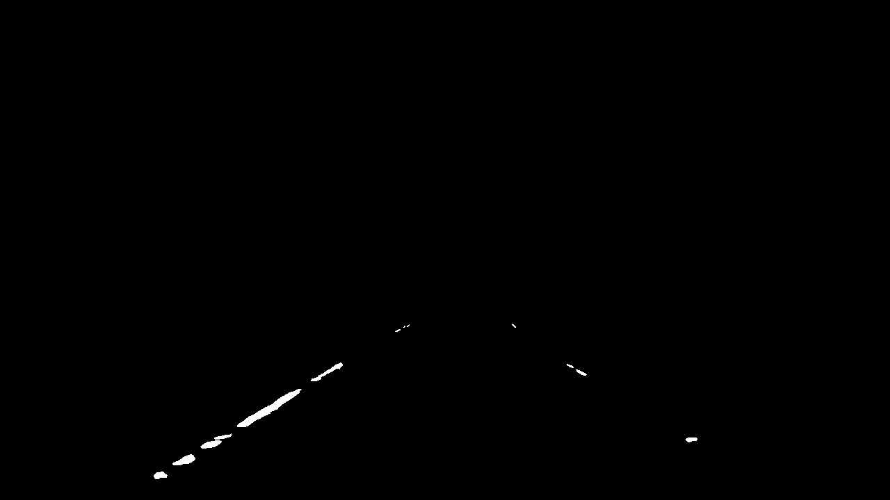
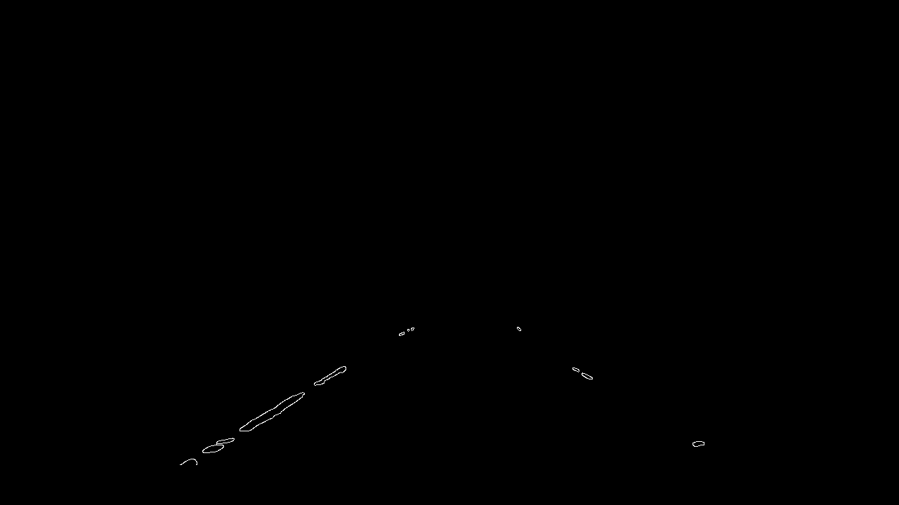
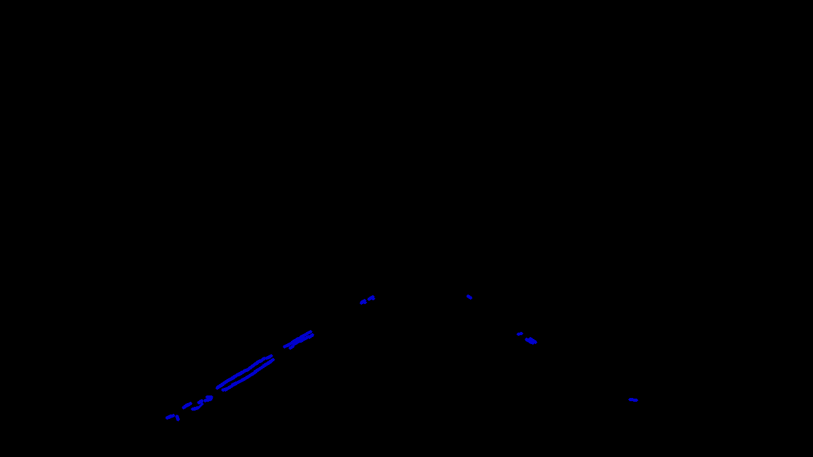
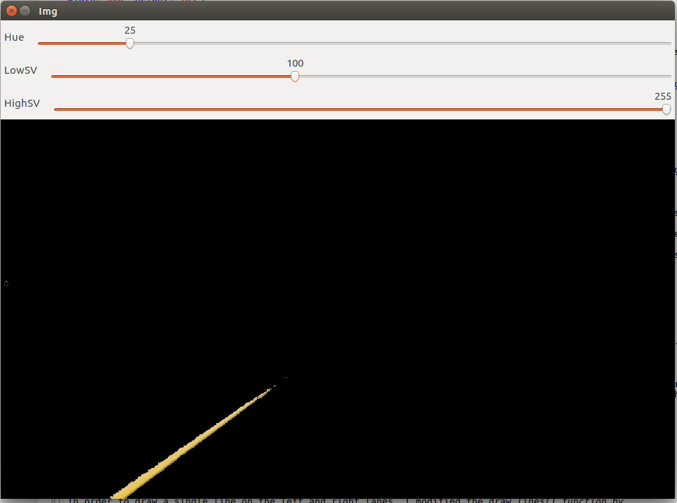
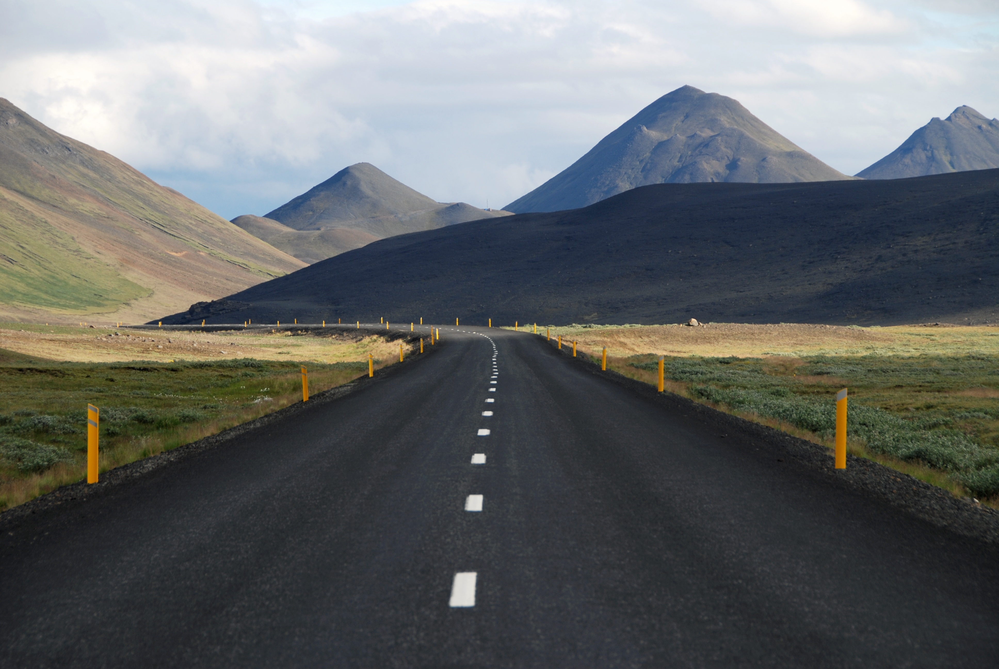

**Finding Lane Lines on the Road**

[//]: # (Image References)

[image1]: ./examples/grayscale.jpg "Grayscale"

---

### Reflection

### 1. Pipeline description

The pipeline used are explained in the sections that follows. Throughout the description, a sample image frame from the challenge video is used to demonstrate the marginal impact of each step. The frame selected corresponds to the 148th frame from the challenge video. This frame is chosen because it contains interferences such as 1) tree shadows, 2) yellow and white lines, and 3) uneven lighting.


#### 1.1 Filtering

A preprocessing step of filtering the color of interest is performed. First, this is done by converting the color channel from RGB to HSV. Yellow and White HSV ranges are determined from selected frames of test videos using [TrackerBar](#1.5.1-TrackerBar). However, only yellow HSV filtering was employed as white HSV filtering was found to be ineffective in the challenge video.


Yellow filtering was performed using HSV range of (15, 115, 255) and (35, 115, 255)

**Before**



**After Yellow Filtering**



White filtering was performed by using global thresholding of grayscale image, where the threshold is taken to be 97.5 percentile of the grayscale array.

**After White Filtering**



Yellow image was binary thresholded (using Otsu to determine threshold value) before being combined with white filtered image using `bitwise_or`. The image is then passed through a region of interest mask.

**After White and Yellow Filtering, and Region of Interest Mask**




#### 1.2 Canny edges

The image is then put through a Canny algorithm to output edges. This algorithm identifies edges from a grayscale image by considering the differential across directions.



#### 1.3 Hough Line

From the detected Canny edges, each point is then mapped into a Hough space where points along the same line in the initial image will intersect in Hough space. Line segments that are identified in this manner will then be the drawn on a blank canvas as below



#### 1.4 Drawlines

Next, we intend to draw a single line for each of the left and right lanes based on the obtained Hough line segments. The `draw_lines` function was modified to keep track of slope, intersect, and side of the lane (i.e. left or right). First, the slopes and intersect are calculated for each of the line segments. Next, the average are determined for each of the left and right groups' slopes and intersect. To avoid the influence of outliers, only elements within a certain distance from the median are included in the average calculation. Finally, using the average slope and intersect, a line is drawn onto the image within the region of interest.


#### 1.5 Tools used

##### 1.5.1 TrackerBar

Frequently in the exploratory process of building the pipeline, many of the parameter values had to be tuned. Parameters such as HSV filtering range, Canny edge threshold, percentile used in binary threshold, and etc. In order to facilitate such a process, a tool known as TrackerBar is developed.

The TrackerBar is a wrapper function which takes in 1) any function that outputs an image, and 2) an arbitrary number of parameters used in the function. When called, the TrackerBar will display a continuously drawn image using the parameter values set on the tracker bars. An example is provided below,

```python
def ExtractColor2(img):
    
    # ASSUMES INPUT CHANNEL TO BE BGR
    # HSV parameters global such that trackerBar function can be used as wrapper
    
    # Hue, LowSV, HighSV = HSVRange
    
    img_HSV      = cv2.cvtColor(img, cv2.COLOR_BGR2HSV)
    
    low_color    = np.array([Hue - 10, LowSV, LowSV])
    high_color   = np.array([Hue + 10, HighSV, HighSV])
    
    mask_Hue     = cv2.inRange(img_HSV, low_color, high_color)
       
    img_Filtered = cv2.bitwise_and(img_HSV, img_HSV, mask = mask_Hue)
    
    return cv2.cvtColor(img_Filtered, cv2.COLOR_HSV2RGB)
```


To add tracker bars to each of the three parameters used in the function `ExtractColor2` above, all we have to do is


```python

imgIn = cv2.imread('test_images/solidYellowCurve.jpg', 1)

trackerBar(ExtractColor2,
           Hue    = 179,
           LowSV  = 255,
           HighSV = 255)(imgIn)
```

And we will then be able to visually explore those parameters





### 2. Potential shortcomings with current pipeline

There are however several potential shortcomings, which are discussed as below,

#### 2.1 White filtering when lighting varies

With the use of binary thresholding for white lane filtering, the main assumption was that white lane lines are constantly brighter than other parts of the image. Therefore, the pipeline performance could be significantly affected whenever this assumption breaks down. Among some of those situations are 1) varying lighting condition among valid lane lines, and 2) presence of snow. Whenever these occurs, the relative brightness of the image is no longer a good indication of white lane line locations.

#### 2.2 Smoothing between frames

Another issue might be stability of the lane line annotations on video streams. As the lane line algorithms are applied frame by frame and are completely independent of information in other frames, the line annotations could have sharp fluctuations. This is especially true when in certain frames, the algorithm performs so poorly that the slope/intersect are severely inaccurate. In such cases, annotated lane lines would exhibit sudden large movements across frames. This is highly undesirable as it may trigger sudden large steering angles changes.

#### 2.3 No lines on side of road

The pipeline also assumes that lane lines are either white or yellow. In reality, it is very common for roads to not have any line markings on the leftmost and rightmost side of the road. In these roads, the demarcations on the leftmost and rightmost are neither white nor yellow. For example,




### 3. Suggest possible improvements to your pipeline

Several suggestions that could be incorporated to the pipeline to address issues 2.1 - 2.3 above are:

#### 3.1 White lane lines identification

It might be possible to transform the image space to something other than HSV where white color can be isolated better. Alternatively, we could also try to isolate white color in smaller blocks as opposed to globally. This could allow white lanes which have different brightness to be identified as long as within their own blocks, those white lanes are brighter than their adjacent areas. 

For snow that actually covers the road, image recognition might not be the most effective tool. It might be better to incorporate radar/lidar distance estimation methods instead.

#### 3.2 Sudden fluctuations in annotated lane lines

To prevent sudden fluctuations across frames, we could employ a rolling average mechanism. We would use only the most recent X number of frames in determining current frame's line estimate, and update the oldest frame in the set with the newest frame as we process the next frame. The number of frames kept in the set should be chosen with care because we want to 1) maintain that our line estimation is sufficiently sensitive to new information, but at the same time also 2) transition smoothly from prior frames. We could also use polynomials in specifying lane lines instead of straight lines to incorporate the fact that certain roads are curved. This may however be non-trivial.

#### 3.3 Identifying more types of lanes

To identify lane lines that are neither yellow nor white, our pipeline needs to be enhanced. In particular, we could add edge detection on source image that are not color-filtered. This can be achieved by taking the sum of edges obtained by using 1) white filtering, 2) yellow filtering, and 3) unfiltered. The weights used is another parameter that has to be determined. For more robust application, the weights could be dynamically determined. For example, if there are no white or yellow lines detected, then the pipeline would place a higher weight on edges determined from the unfiltered image.
